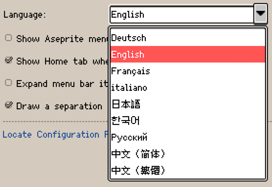

# Aseprite Unified Languages

[Aseprite](https://github.com/aseprite/aseprite) extension to support multiple languages.

## Supported languages

| English Name | Display Name | Source | Sync | Translated | Missing | Progress |
|---|---|---|---|---:|---:|---:|
| Chinese (Simplified) | 中文（简体） | [Link](https://github.com/aseprite-quest/aseprite-language-chinese-simplified) | [Link](https://github.com/aseprite-quest/aseprite-language-chinese-simplified) | 1613 / 1613 | 0 | 100.00% 🚩 |
| Chinese (Traditional) | 中文（繁體） | [Link](https://github.com/5idereal/Aseprite-Traditional-Chinese-Translation) | [Link](https://github.com/aseprite-quest/aseprite-language-chinese-traditional) | 1613 / 1613 | 0 | 100.00% 🚩 |
| Russian | Русский | [Link](https://github.com/lufog/aseprite-language-russian) | [Link](https://github.com/aseprite-quest/aseprite-language-russian) | 1613 / 1613 | 0 | 100.00% 🚩 |
| Italian | italiano | [Link](https://github.com/FabianoIlCapo/aseprite_italian) | [Link](https://github.com/aseprite-quest/aseprite-language-italian) | 1593 / 1613 | 20 | 98.76% 🚧 |
| French | Français | [Link](https://github.com/boubl/Aseprite-French-Translation) | [Link](https://github.com/aseprite-quest/aseprite-language-french) | 1613 / 1613 | 0 | 100.00% 🚩 |
| Japanese | 日本語 | [Link](https://github.com/aseprite-quest/aseprite-language-japanese) | [Link](https://github.com/aseprite-quest/aseprite-language-japanese) | 1194 / 1613 | 419 | 74.02% 🚧 |
| Korean | 한국어 | [Link](https://github.com/ImBada/Aseprite-Korean) | [Link](https://github.com/aseprite-quest/aseprite-language-korean) | 1193 / 1613 | 420 | 73.96% 🚧 |
| German | Deutsch | [Link](https://github.com/dotheflopboy/Aseprite-German-Translation) | [Link](https://github.com/aseprite-quest/aseprite-language-german) | 1154 / 1613 | 459 | 71.54% 🚧 |
| Spanish | español | [Link](https://github.com/raxdraws/aseprite-spanish) | [Link](https://github.com/aseprite-quest/aseprite-language-spanish) | 1187 / 1613 | 426 | 73.59% 🚧 |
| Ukrainian | українська | [Link](https://github.com/Steenuga/aseprite-language-ukrainian) | [Link](https://github.com/aseprite-quest/aseprite-language-ukrainian) | 1283 / 1613 | 330 | 79.54% 🚧 |
| Polish | polski | [Link](https://github.com/PxSprite/aseprite-beta-pl) | [Link](https://github.com/aseprite-quest/aseprite-language-polish) | 1283 / 1613 | 330 | 79.54% 🚧 |
| Portuguese (Brazil) | português (Brasil) | [Link](https://github.com/puddiCria/aseprite-pt-br) | [Link](https://github.com/aseprite-quest/aseprite-language-portuguese-brazil) | 1239 / 1613 | 374 | 76.81% 🚧 |
| Maltese | Malti | [Link](https://github.com/DimensionalSpace/Maltese-Aseprite) | [Link](https://github.com/aseprite-quest/aseprite-language-maltese) | 1539 / 1613 | 74 | 95.41% 🚧 |

## Tools

- [Aseprite INI](https://github.com/aseprite-quest/aseprite-ini)

## References

- [Aseprite Docs - Extensions - Languages](https://aseprite.org/docs/extensions/languages)
- [IETF language tag](https://en.wikipedia.org/wiki/IETF_language_tag)
- [Letter codes of cultures (languages, countries / regions) - list](https://www.venea.net/web/culture_code)
- [MDN - CSS pseudo-class - :lang()](https://developer.mozilla.org/en-US/docs/Web/CSS/:lang)

## License

Translations under the Creative Commons Attribution 4.0 International License.

Scripts under the [MIT License](LICENSE).
