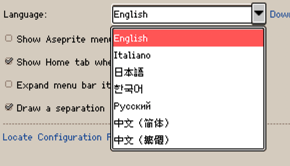

# Aseprite Unified Languages

[Aseprite](https://github.com/aseprite/aseprite) extension to support multiple languages.

## Supported languages

| English Name | Display Name | File | Translated | Missing | Progress |
|---|---|---|---:|---:|---:|
| Chinese (Simplified) | 中文（简体） | [zh-hans.ini](data/zh-hans.ini) | 1587 / 1598 | 11 | 99.31% 🚧 |
| Chinese (Traditional) | 中文（繁體） | [zh-hant.ini](data/zh-hant.ini) | 1598 / 1598 | 0 | 100.00% 🚩 |
| Japanese | 日本語 | [ja.ini](data/ja.ini) | 1199 / 1598 | 399 | 75.03% 🚧 |
| Korean | 한국어 | [ko.ini](data/ko.ini) | 1199 / 1598 | 399 | 75.03% 🚧 |
| Russian | Русский | [ru.ini](data/ru.ini) | 1593 / 1598 | 5 | 99.69% 🚧 |
| Italian | italiano | [it.ini](data/it.ini) | 1598 / 1598 | 0 | 100.00% 🚩 |

## Usage

Download the latest version `.aseprite-extension` file in the [Releases](https://github.com/aseprite-quest/aseprite-unified-languages/releases), and then follow the [Documentation](https://www.aseprite.org/docs/extensions/) to install it.

## Sync source repositories

- [Chinese (Simplified)](https://github.com/aseprite-quest/aseprite-language-chinese-simplified)
- [Chinese (Traditional)](https://github.com/5idereal/Aseprite-Traditional-Chinese-Translation)
- [Russian](https://github.com/lufog/aseprite-language-russian)
- [Italian](https://github.com/FabianoIlCapo/aseprite_italian)

## Dependencies

- [Aseprite INI](https://github.com/aseprite-quest/aseprite-ini)

## References

- [Aseprite Docs - Extensions - Languages](https://aseprite.org/docs/extensions/languages)
- [IETF language tag](https://en.wikipedia.org/wiki/IETF_language_tag)
- [Letter codes of cultures (languages, countries / regions) - list](https://www.venea.net/web/culture_code)
- [MDN - CSS pseudo-class - :lang()](https://developer.mozilla.org/en-US/docs/Web/CSS/:lang)
- [Chinese (Simplified)](https://github.com/J-11/Aseprite-Simplified-Chinese)
- [Chinese (Traditional)](https://github.com/5idereal/Aseprite-Traditional-Chinese-Translation)
- [Japanese](https://wikiwiki.jp/aseprite/日本語化ファイルのダウンロード)
- [Korean](https://github.com/ImBada/Aseprite-Korean)
- [Russian](https://github.com/lufog/aseprite-language-russian)
- [Italian](https://github.com/FabianoIlCapo/aseprite_italian)

## License

Translations are under the [Creative Commons Attribution 4.0 International License](data/LICENSE.txt).

Scripts are under the [MIT License](LICENSE).
